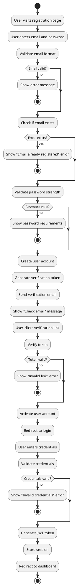
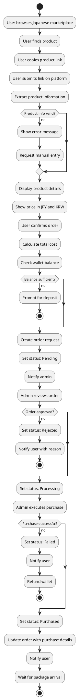
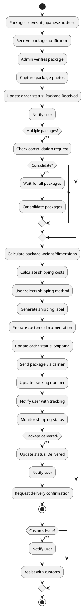
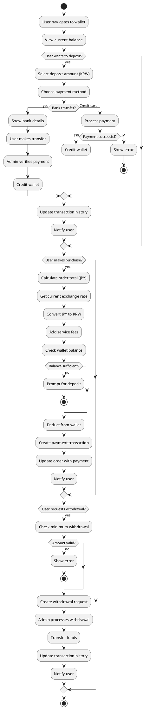
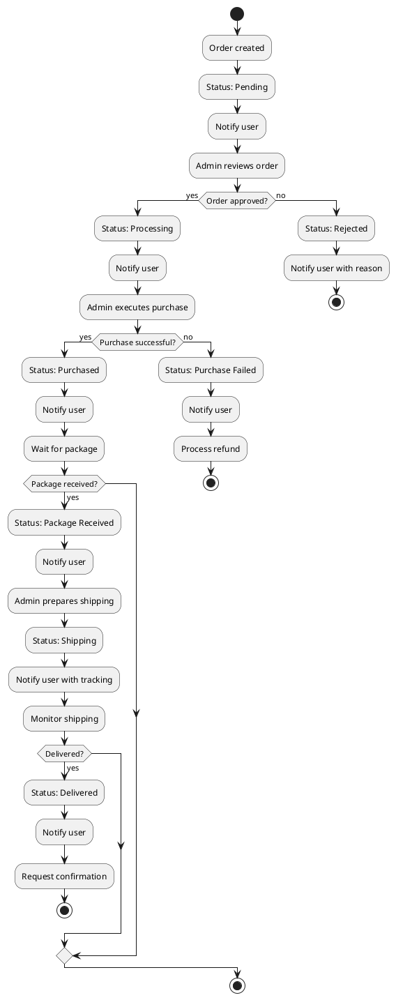
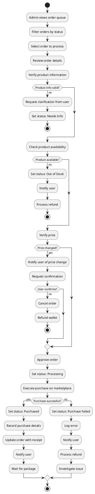
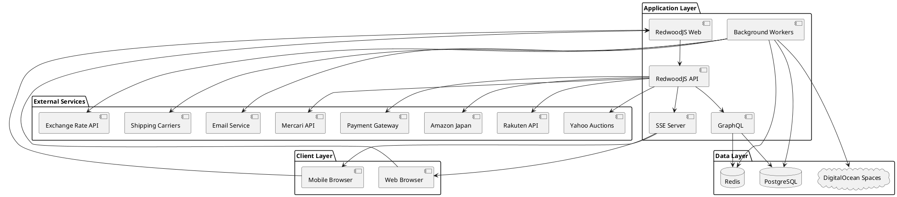
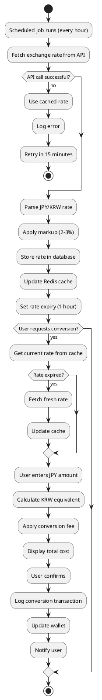

# System Flowcharts

This document contains visual flowcharts for the Japanese Proxy Shopping Platform system. All diagrams use embedded PlantUML code that can be rendered using VS Code extensions or online tools.

> 📖 **Navigation:** [← Back to README](./README.md) | [Project Proposal](./japanese-proxy-shopping-platform.md) | [Infrastructure Requirements](./development-requirements-and-costing.md) | [Costing & Support Terms](./development-costing-and-support-terms.md)

---

## 1. User Registration & Authentication Flow

**User Registration & Authentication Process**

This flowchart shows the complete user registration and authentication process for customers.

**Key Elements:**

- Email/password registration
- Email verification
- Login authentication
- JWT token generation
- Session management
- Password reset functionality
- Error handling and retry options

**Use Cases:**

- Understanding registration and login security flow
- Explaining authentication to stakeholders
- Development reference for authentication implementation
- User onboarding process documentation

**PlantUML Code:**

---

## 2. Proxy Buying Request Flow

**Proxy Buying Request Workflow**

This flowchart visualizes the complete workflow from product link submission to purchase completion.

**Key Elements:**

- User submits product link
- Product information extraction
- Price verification
- Order request creation
- Admin review and processing
- Purchase execution
- Order status updates
- Notification system

**Use Cases:**

- Explaining order process to customers
- Training admin staff on order processing
- Development reference for order system
- Stakeholder understanding of proxy buying workflow

**PlantUML Code:**

---

## 3. Shipping Forwarding Flow

**Shipping Forwarding Process**

This flowchart shows how packages are received, consolidated, and shipped internationally to Korea.

**Key Elements:**

- Package received at Japanese address
- Package verification
- Photo capture
- Consolidation options
- Shipping method selection
- Cost calculation
- Customs documentation
- International shipping
- Delivery tracking

**Use Cases:**

- Understanding shipping workflow
- Training shipping staff
- Development reference for shipping system
- Customer communication about shipping process

**PlantUML Code:**

---

## 4. Payment & Wallet Flow

**Payment & Wallet Management**

This flowchart illustrates the wallet deposit, currency conversion, and payment processing workflow.

**Key Elements:**

- Wallet deposit process
- Currency conversion (KRW to JPY)
- Exchange rate updates
- Payment processing
- Transaction history
- Withdrawal requests

**Use Cases:**

- Understanding payment workflow
- Explaining currency conversion to users
- Development reference for payment system
- Financial reconciliation process

**PlantUML Code:**

---

## 5. Order Tracking Flow

**Order Status Tracking System**

This flowchart shows how order status is tracked and updated throughout the entire order lifecycle.

**Key Elements:**

- Order status updates
- Real-time notifications
- Status change triggers
- Timeline display
- Activity logging

**Use Cases:**

- Understanding order lifecycle
- Customer support reference
- Development reference for tracking system
- User communication about order status

**PlantUML Code:**

---

## 6. Admin Order Processing Flow

**Admin Order Processing Workflow**

This flowchart illustrates how admins process orders from review to purchase execution.

**Key Elements:**

- Order queue management
- Product verification
- Purchase execution
- Status updates
- Error handling
- Communication with users

**Use Cases:**

- Admin training and onboarding
- Understanding order processing workflow
- Development reference for admin panel
- Process optimization

**PlantUML Code:**

---

## 7. System Architecture Flow

**High-Level System Architecture**

This flowchart provides a high-level overview of system components and their interactions.

**Key Elements:**

- Client-server architecture
- Application layer components (Web, API, SSE, Workers)
- Data layer structure (PostgreSQL, Redis, Storage)
- External service integrations (Marketplaces, Shipping, Payment, Email)

**Use Cases:**

- Technical architecture overview
- Infrastructure planning
- Explaining system design to stakeholders
- Onboarding new developers

**PlantUML Code:**

---

## 8. Currency Conversion Flow

**Currency Conversion Process**

This flowchart shows how exchange rates are updated and currency conversions are performed.

**Key Elements:**

- Exchange rate updates
- Rate caching
- Conversion calculation
- Fee application
- Transaction logging

**Use Cases:**

- Understanding currency conversion
- Explaining exchange rates to users
- Development reference for conversion system
- Financial reconciliation

**PlantUML Code:**

