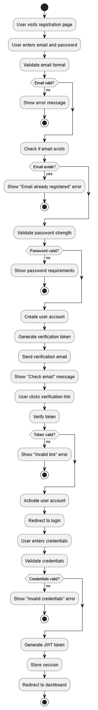
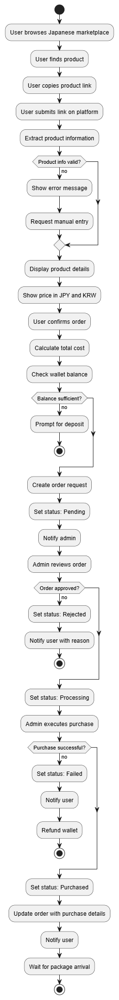
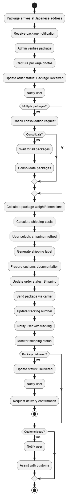
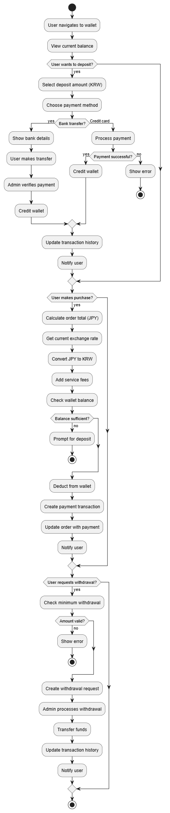
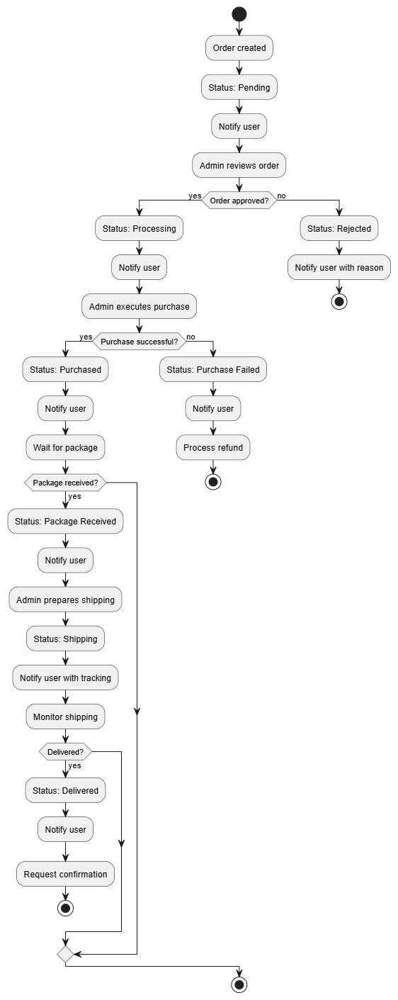
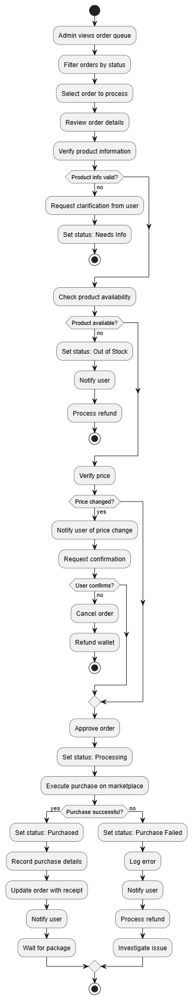
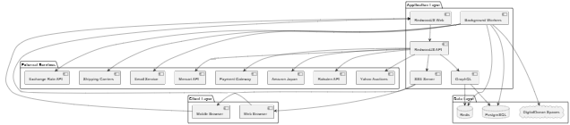
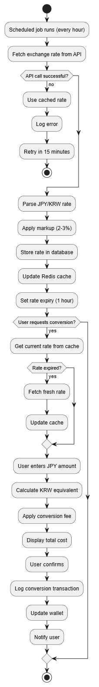

# System Flowcharts

This document contains visual flowcharts for the Japanese Proxy Shopping Platform system. All diagrams are generated from PlantUML source files located in the [`flowcharts/`](./flowcharts/) folder.

> 📖 **Navigation:** [← Back to README](./README.md) | [Project Proposal](./japanese-proxy-shopping-platform.md) | [Infrastructure Requirements](./development-requirements-and-costing.md) | [Costing & Support Terms](./development-costing-and-support-terms.md)

---

## 1. User Registration & Authentication Flow



**User Registration & Authentication Process**

This flowchart shows the complete user registration and authentication process for customers.

**Key Elements:**
- Email/password registration
- Email verification
- Login authentication
- JWT token generation
- Session management
- Password reset functionality
- Error handling and retry options

**Use Cases:**
- Understanding registration and login security flow
- Explaining authentication to stakeholders
- Development reference for authentication implementation
- User onboarding process documentation

**Source:** [`flowcharts/1.puml`](./flowcharts/1.puml)

---

## 2. Proxy Buying Request Flow



**Proxy Buying Request Workflow**

This flowchart visualizes the complete workflow from product link submission to purchase completion.

**Key Elements:**
- User submits product link
- Product information extraction
- Price verification
- Order request creation
- Admin review and processing
- Purchase execution
- Order status updates
- Notification system

**Use Cases:**
- Explaining order process to customers
- Training admin staff on order processing
- Development reference for order system
- Stakeholder understanding of proxy buying workflow

**Source:** [`flowcharts/2.puml`](./flowcharts/2.puml)

---

## 3. Shipping Forwarding Flow



**Shipping Forwarding Process**

This flowchart shows how packages are received, consolidated, and shipped internationally to Korea.

**Key Elements:**
- Package received at Japanese address
- Package verification
- Photo capture
- Consolidation options
- Shipping method selection
- Cost calculation
- Customs documentation
- International shipping
- Delivery tracking

**Use Cases:**
- Understanding shipping workflow
- Training shipping staff
- Development reference for shipping system
- Customer communication about shipping process

**Source:** [`flowcharts/3.puml`](./flowcharts/3.puml)

---

## 4. Payment & Wallet Flow



**Payment & Wallet Management**

This flowchart illustrates the wallet deposit, currency conversion, and payment processing workflow.

**Key Elements:**
- Wallet deposit process
- Currency conversion (KRW to JPY)
- Exchange rate updates
- Payment processing
- Transaction history
- Withdrawal requests

**Use Cases:**
- Understanding payment workflow
- Explaining currency conversion to users
- Development reference for payment system
- Financial reconciliation process

**Source:** [`flowcharts/4.puml`](./flowcharts/4.puml)

---

## 5. Order Tracking Flow



**Order Status Tracking System**

This flowchart shows how order status is tracked and updated throughout the entire order lifecycle.

**Key Elements:**
- Order status updates
- Real-time notifications
- Status change triggers
- Timeline display
- Activity logging

**Use Cases:**
- Understanding order lifecycle
- Customer support reference
- Development reference for tracking system
- User communication about order status

**Source:** [`flowcharts/5.puml`](./flowcharts/5.puml)

---

## 6. Admin Order Processing Flow



**Admin Order Processing Workflow**

This flowchart illustrates how admins process orders from review to purchase execution.

**Key Elements:**
- Order queue management
- Product verification
- Purchase execution
- Status updates
- Error handling
- Communication with users

**Use Cases:**
- Admin training and onboarding
- Understanding order processing workflow
- Development reference for admin panel
- Process optimization

**Source:** [`flowcharts/6.puml`](./flowcharts/6.puml)

---

## 7. System Architecture Flow



**High-Level System Architecture**

This flowchart provides a high-level overview of system components and their interactions.

**Key Elements:**
- Client-server architecture
- Application layer components (Web, API, SSE, Workers)
- Data layer structure (PostgreSQL, Redis, Storage)
- External service integrations (Marketplaces, Shipping, Payment, Email)

**Use Cases:**
- Technical architecture overview
- Infrastructure planning
- Explaining system design to stakeholders
- Onboarding new developers

**Source:** [`flowcharts/7.puml`](./flowcharts/7.puml)

---

## 8. Currency Conversion Flow



**Currency Conversion Process**

This flowchart shows how exchange rates are updated and currency conversions are performed.

**Key Elements:**
- Exchange rate updates
- Rate caching
- Conversion calculation
- Fee application
- Transaction logging

**Use Cases:**
- Understanding currency conversion
- Explaining exchange rates to users
- Development reference for conversion system
- Financial reconciliation

**Source:** [`flowcharts/8.puml`](./flowcharts/8.puml)

---

## 🛠️ How to Update Flowcharts

### Editing Flowcharts

1. Edit the `.puml` file in the [`flowcharts/`](./flowcharts/) folder
2. Regenerate the PNG image using PlantUML:
   ```bash
   java -jar plantuml.jar flowcharts/1.puml
   ```
3. The image will automatically update in this document

### Rendering Options

**VS Code:**
- Install "PlantUML" extension
- Open `.puml` file
- Press `Alt+D` to preview

**Online:**
- Visit [PlantUML Online Server](http://www.plantuml.com/plantuml/uml/)
- Copy code from `.puml` file
- Paste and render

**Command Line:**
```bash
# Render all flowcharts
java -jar plantuml.jar flowcharts/*.puml

# Render specific flowchart
java -jar plantuml.jar flowcharts/1.puml
```

---

## 📋 Additional Flowcharts to Consider

Future flowcharts that could be added:

1. **Product Search & Browsing Flow** - How users discover products across marketplaces
2. **Wallet Deposit/Withdrawal Flow** - Detailed deposit and withdrawal processes
3. **Admin Dashboard Data Flow** - How data flows to admin analytics
4. **Error Handling & Recovery** - API failure scenarios and retry mechanisms
5. **Database Schema Relationships** - Entity relationships and data model
6. **Deployment Flow** - CI/CD pipeline and environment promotion
7. **Notification System Flow** - Email, SMS, and in-app notification delivery

---

> 📖 **Navigation:** [← Back to README](./README.md) | [Project Proposal](./japanese-proxy-shopping-platform.md) | [Infrastructure Requirements](./development-requirements-and-costing.md) | [Costing & Support Terms](./development-costing-and-support-terms.md)
