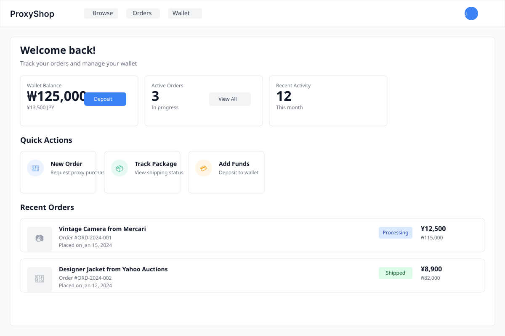
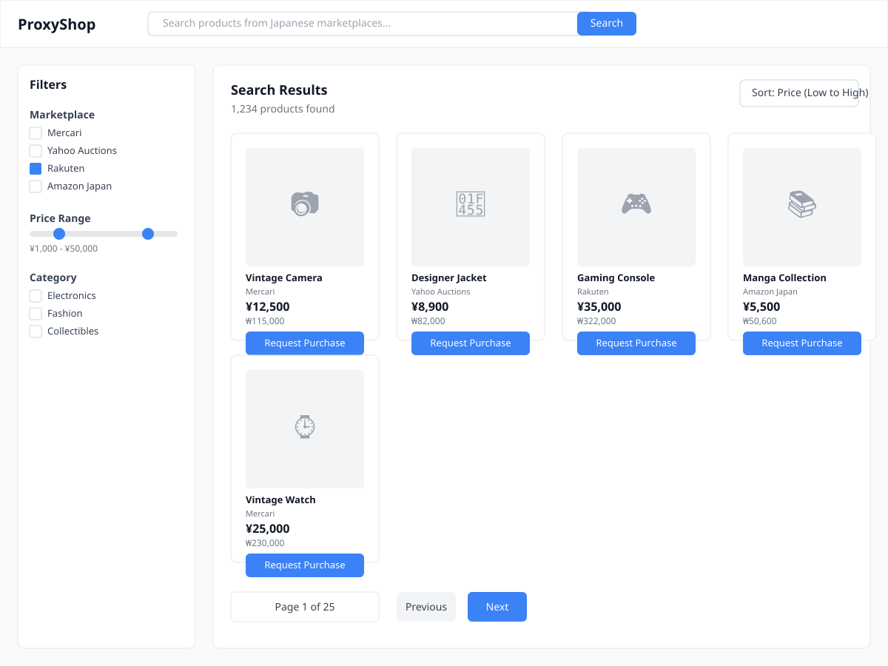
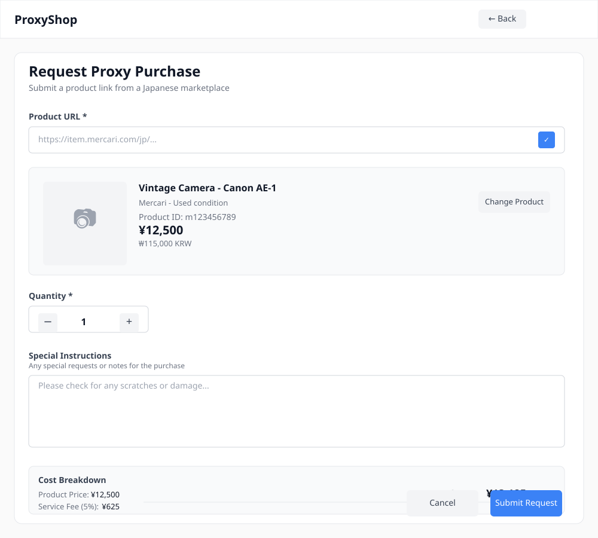
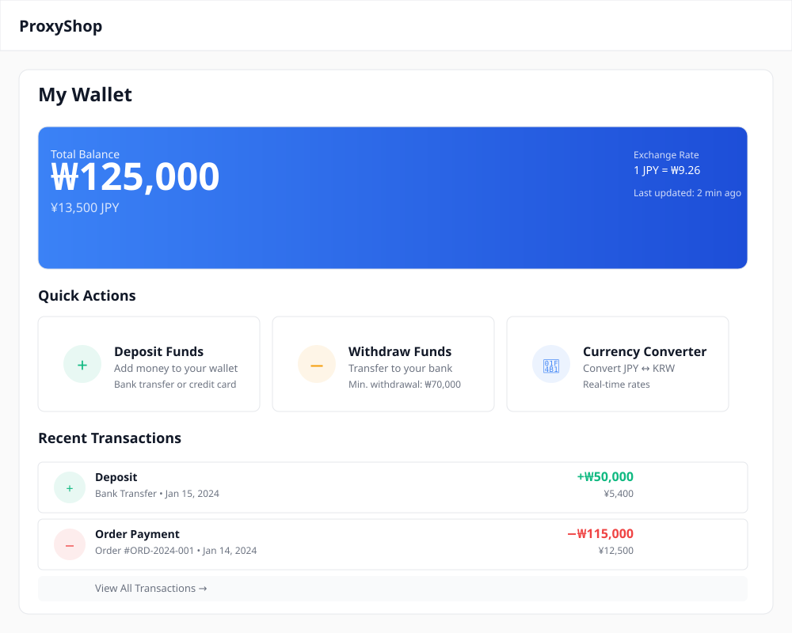
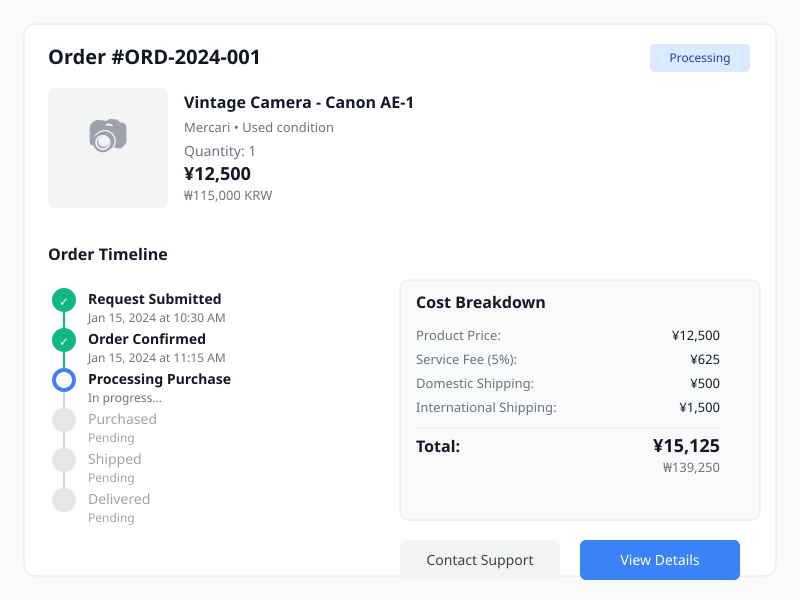
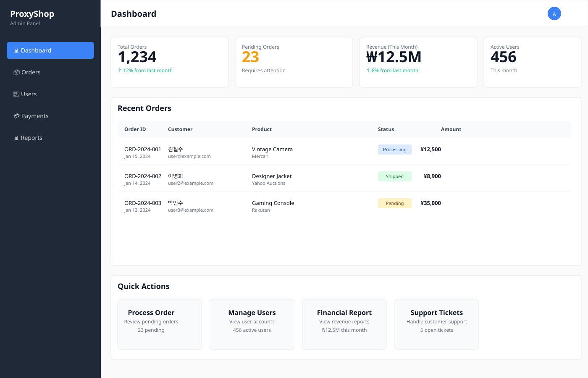

# UI/UX Design Samples - Japanese Proxy Shopping Platform

**Project:** Japanese Proxy Shopping Platform  
**Prepared by:** Jemuel Lupo  
**Date:** [Current Date]

---

> 📖 **Navigation:** [← Back to README](./README.md) | [Project Proposal](./japanese-proxy-shopping-platform.md) | [Development Costing & Support Terms](./development-costing-and-support-terms.md)

---

## ⚠️ Important Note

**These are preliminary UI mockups, not final designs.**

The SVG samples below are **visual mockups** created to demonstrate the UI/UX direction and layout structure for the Japanese Proxy Shopping Platform. They serve as:

- **Design direction references** for the development team
- **Layout and component structure** examples
- **User flow visualization** for key features
- **ShadCN component integration** examples

**Final Implementation:**

- All UI/UX designs will be created using **ShadCN components** during development
- Designs will be fully responsive and interactive
- Final designs will match the platform's branding and requirements
- All components will be implemented as functional React components

These mockups help visualize the platform's structure and user experience before final design implementation begins.

---

## 📱 Sample Screens

### 1. User Dashboard Homepage

**File:** [`ui-samples/dashboard-layout.svg`](./ui-samples/dashboard-layout.svg)

**Description:**
The main user dashboard provides an overview of account activity, wallet balance, and recent orders. Users can quickly access key features and see their order status at a glance.

**Key Features:**

- Wallet balance display with dual currency (KRW/JPY)
- Active orders counter
- Recent activity summary
- Quick action buttons (New Order, Track Package, Add Funds)
- Recent orders list with status indicators

**Layout:**

- Clean header navigation
- Stats cards in a grid layout
- Quick action cards for common tasks
- Order history with expandable details

---

### 2. Product Search & Browsing Interface

**File:** [`ui-samples/product-search-interface.svg`](./ui-samples/product-search-interface.svg)

**Description:**
The product browsing interface allows users to search and filter products from multiple Japanese marketplaces. Users can view products, compare prices, and request purchases directly from search results.

**Key Features:**

- Search bar with marketplace filtering
- Sidebar filters (Marketplace, Price Range, Category)
- Product grid with images and details
- Dual currency display (JPY/KRW) on each product
- "Request Purchase" buttons on product cards
- Sort and pagination controls

**Layout:**

- Filter sidebar on the left
- Main product grid in the center
- Responsive card-based product display
- Clear visual hierarchy

---

### 3. Order Request Form

**File:** [`ui-samples/order-request-form.svg`](./ui-samples/order-request-form.svg)

**Description:**
The order request form allows users to submit proxy purchase requests by entering a product URL from Japanese marketplaces. The form validates the product, shows a preview, and calculates costs before submission.

**Key Features:**

- Product URL input with validation
- Automatic product information extraction
- Product preview card
- Quantity selector
- Special instructions textarea
- Real-time cost breakdown
- Clear pricing transparency

**Layout:**

- Step-by-step form flow
- Product preview section
- Cost breakdown sidebar
- Clear call-to-action buttons

---

### 4. Wallet Management Dashboard

**File:** [`ui-samples/wallet-dashboard.svg`](./ui-samples/wallet-dashboard.svg)

**Description:**
The wallet dashboard provides users with a comprehensive view of their account balance, transaction history, and quick access to deposit/withdrawal functions. Real-time currency conversion is displayed prominently.

**Key Features:**

- Prominent balance display with gradient card design
- Real-time JPY/KRW exchange rate
- Quick action cards (Deposit, Withdraw, Currency Converter)
- Transaction history with color-coded types
- Clear transaction details and timestamps

**Layout:**

- Hero balance card at the top
- Quick action buttons in a grid
- Transaction list with clear visual separation
- Financial-focused, trustworthy design

---

### 5. Order Tracking Card

**File:** [`ui-samples/order-tracking-card.svg`](./ui-samples/order-tracking-card.svg)

**Description:**
The order tracking interface shows detailed information about a specific order, including product details, order timeline, and cost breakdown. Users can see exactly where their order is in the fulfillment process.

**Key Features:**

- Order details header with status badge
- Product information display
- Visual timeline with progress indicators
- Status steps (Request → Confirmed → Processing → Purchased → Shipped → Delivered)
- Detailed cost breakdown
- Support and detail view actions

**Layout:**

- Timeline on the left showing order progress
- Product and cost information on the right
- Clear visual status indicators
- Action buttons for support and details

---

### 6. Admin Dashboard

**File:** [`ui-samples/admin-dashboard.svg`](./ui-samples/admin-dashboard.svg)

**Description:**
The admin dashboard provides administrators with an overview of platform operations, pending orders, revenue, and user activity. Quick access to key administrative functions is available.

**Key Features:**

- Dark sidebar navigation
- Stats cards (Total Orders, Pending Orders, Revenue, Active Users)
- Recent orders table with sortable columns
- Status badges with color coding
- Quick action cards for common admin tasks
- Professional, data-focused design

**Layout:**

- Sidebar navigation for admin sections
- Dashboard stats in a grid
- Data table for recent orders
- Quick action cards for efficiency

---

## 🎨 Design Principles

### Color Scheme

- **Primary Blue** (`#3b82f6`): Main actions, links, primary buttons
- **Success Green** (`#10b981`): Positive states, deposits, completed orders
- **Warning Orange** (`#f59e0b`): Pending states, attention needed
- **Error Red** (`#ef4444`): Withdrawals, negative actions
- **Neutral Grays**: Backgrounds, borders, secondary text

### Typography

- System fonts for optimal performance and consistency
- Clear hierarchy: Large headings (24px), body text (14-16px), secondary text (12px)
- Appropriate font weights for emphasis

### Component Style

- Rounded corners (6-12px radius) for modern feel
- Card-based layouts with subtle borders
- Consistent spacing throughout
- Status badges with semantic colors
- Interactive elements with clear hover states

### Layout Patterns

- Grid-based layouts for product listings
- Card-based information display
- Sidebar navigation for admin interface
- Top navigation for user interface
- Responsive-friendly spacing and structure

---

## 🛠️ Implementation Notes

### ShadCN Component Integration

These mockups will be implemented using ShadCN components:

- **Cards:** `Card`, `CardHeader`, `CardContent`, `CardFooter`
- **Buttons:** `Button` with various variants (primary, secondary, outline)
- **Forms:** `Input`, `Textarea`, `Select`, `Checkbox`, `RadioGroup`
- **Badges:** `Badge` with color variants for status indicators
- **Tables:** `Table`, `TableHeader`, `TableBody`, `TableRow`, `TableCell`
- **Navigation:** `Sidebar`, `NavigationMenu`, `Tabs`
- **Progress:** `Progress` component for timelines
- **Dialogs:** `Dialog` for modals and confirmations
- **Dropdowns:** `DropdownMenu` for filters and actions

### Responsive Design

All designs will be fully responsive:

- **Desktop:** Full layout as shown in mockups
- **Tablet:** Adjusted grid layouts, collapsible sidebars
- **Mobile:** Stacked layouts, bottom navigation, optimized forms

### Accessibility

Final implementation will include:

- Proper ARIA labels
- Keyboard navigation support
- Screen reader compatibility
- Color contrast compliance
- Focus indicators

---

## 📋 Design Process

1. **Review Mockups** (Current Phase)

   - Client reviews these preliminary mockups
   - Feedback on layout, features, and user flow

2. **Design Refinement**

   - Incorporate client feedback
   - Refine color palette and typography
   - Adjust spacing and component sizes

3. **Component Development**

   - Build ShadCN component library
   - Create reusable UI components
   - Implement design system

4. **Integration**

   - Integrate components into RedwoodJS application
   - Connect to backend APIs
   - Add interactivity and animations

5. **Testing & Refinement**
   - User testing and feedback
   - Responsive design testing
   - Accessibility audit
   - Final polish and adjustments

---

## 💡 Key Design Decisions

### Dual Currency Display

All prices and amounts are displayed in both JPY (Japanese Yen) and KRW (Korean Won) to provide transparency and help users understand costs in their local currency.

### Status Indicators

Color-coded status badges provide immediate visual feedback:

- **Blue:** Processing/Active
- **Green:** Completed/Shipped
- **Orange:** Pending/Awaiting
- **Red:** Issues/Cancelled

### Card-Based Layouts

Card-based designs provide:

- Clear information hierarchy
- Easy scanning of content
- Consistent visual structure
- Modern, clean aesthetics

### Quick Actions

Prominent quick action buttons and cards enable users to:

- Access common functions quickly
- Reduce navigation steps
- Improve user experience efficiency

> 📖 **Navigation:** [← Back to README](./README.md) | [Project Proposal](./japanese-proxy-shopping-platform.md) | [Development Costing & Support Terms](./development-costing-and-support-terms.md)

---

**Remember:** These are preliminary mockups for visualization purposes. The final implementation will use ShadCN components and will be fully functional, responsive, and accessible.
